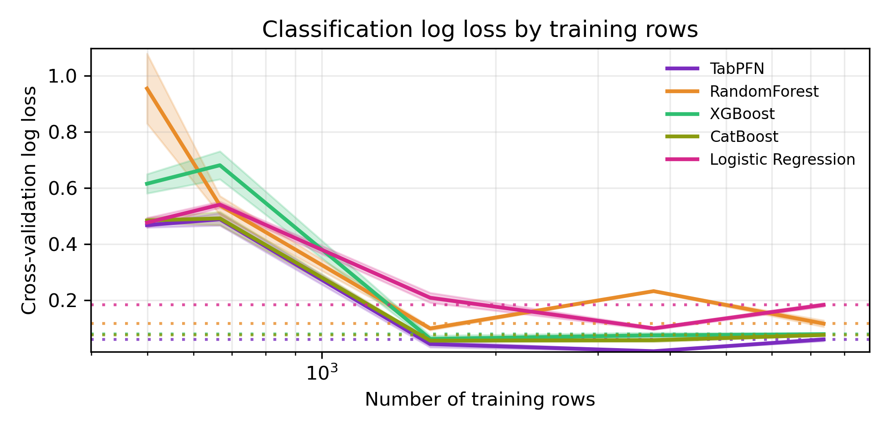
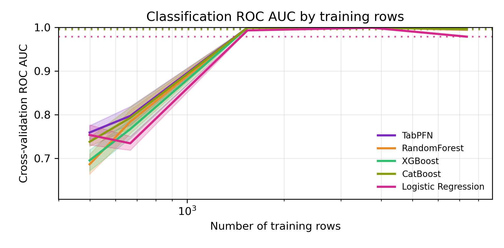
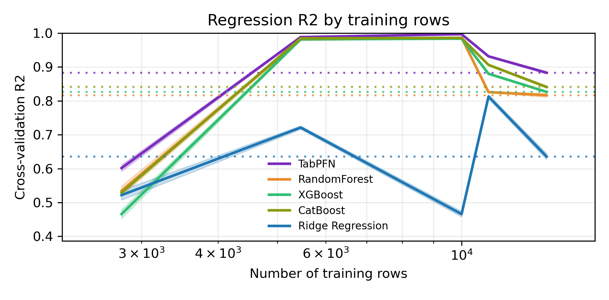
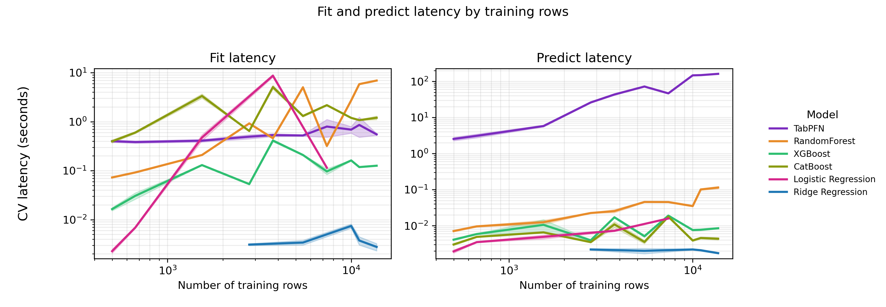

# Task 1: End-to-End TabPFN Benchmark

The first experiment evaluates TabPFN in an end-to-end supervised learning pipeline and compares its performance against commonly used tabular baselines. For classification tasks, TabPFN is compared with Random Forest, XGBoost, CatBoost, and logistic regression. For regression tasks, it is compared with Random Forest, XGBoost, CatBoost, and ridge regression. These baselines were selected to represent both strong tree-based methods and simpler linear models.

## Experimental Setup

To support a fair comparison across different tabular settings, the benchmark uses multiple datasets with varying numbers of samples and features. Classification datasets include credit-g, blood-transfusion, segment, phishing_websites, and optdigits. Regression datasets include cpu_act, abalone, houses, pol, and elevators. Model performance is evaluated using three-fold cross-validation.

For classification, predictive performance is measured using ROC AUC and log loss. ROC AUC evaluates ranking quality, while log loss measures the quality and calibration of predicted class probabilities. For regression, performance is measured using cross-validated R2. In addition to predictive accuracy, fit and prediction latency are measured to examine the computational trade-offs of TabPFN compared with conventional models.

## Classification Results

  
  

Across the classification datasets, TabPFN achieves the highest ROC AUC and lowest log loss among all evaluated models. This indicates that TabPFN provides both strong class discrimination and high-quality probabilistic predictions.

## Regression Results

  

For the regression datasets, TabPFN also achieves the highest R2 across the evaluated tasks, showing consistently strong predictive performance compared with tree-based and linear baselines.

## Latency Trade-Off

  

The latency results show a different trade-off. TabPFN has low and relatively stable fit latency because it does not perform conventional dataset-specific training. Instead, it uses a pretrained foundation model and performs inference directly from the provided context. However, TabPFN has substantially higher prediction latency than the baseline models, particularly as the number of training rows increases. This is expected because TabPFN conditions its predictions on the training examples during inference, making prediction more computationally expensive than tree traversal or linear-model evaluation.

## Summary

Overall, this benchmark suggests that TabPFN can substantially improve predictive performance on small to medium-sized tabular datasets, but this improvement comes with increased inference latency. Therefore, TabPFN is especially attractive when predictive accuracy is the main priority, while faster baseline models may remain preferable in applications requiring very low-latency prediction.
