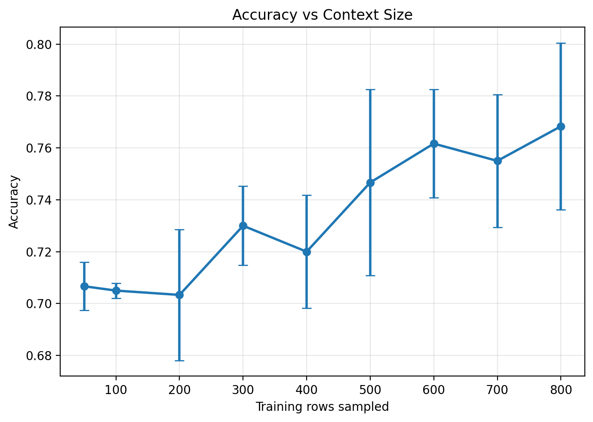
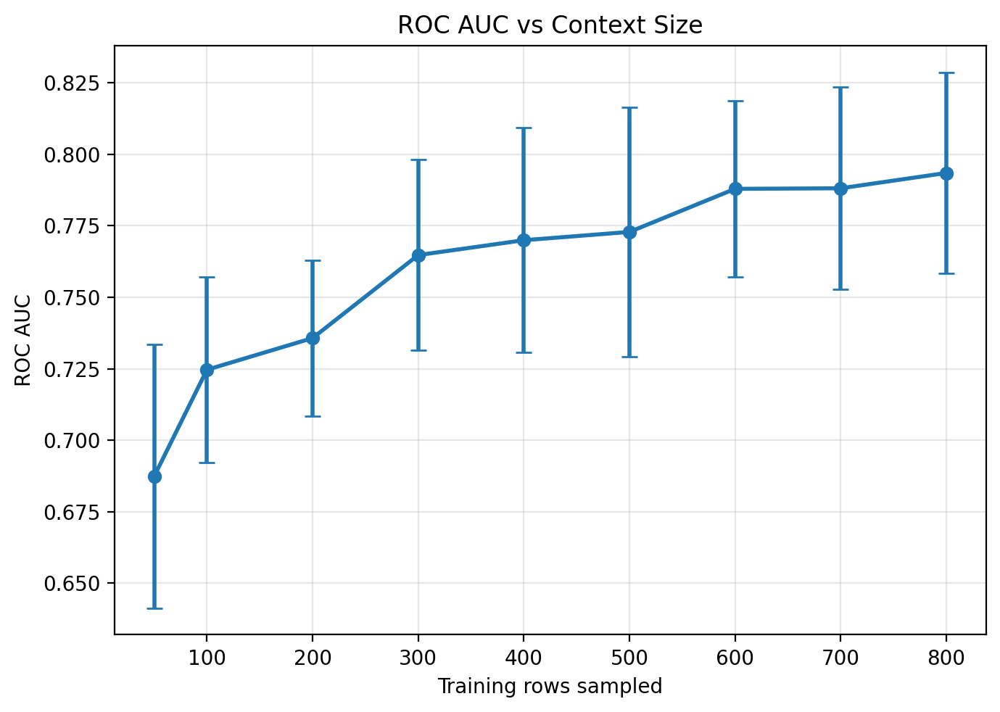
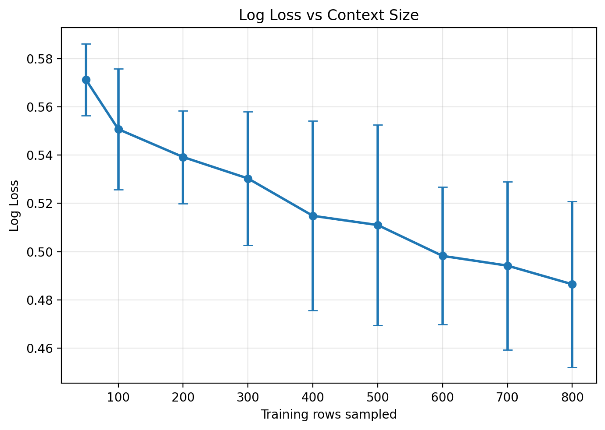
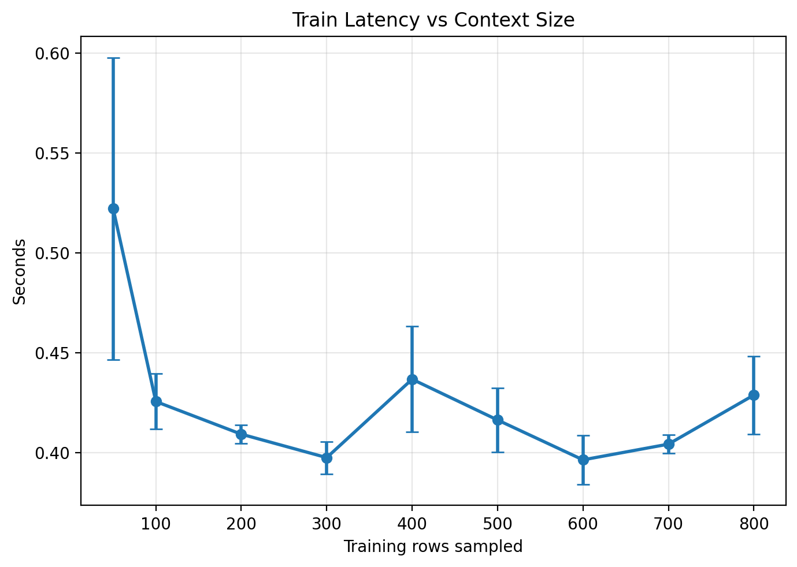
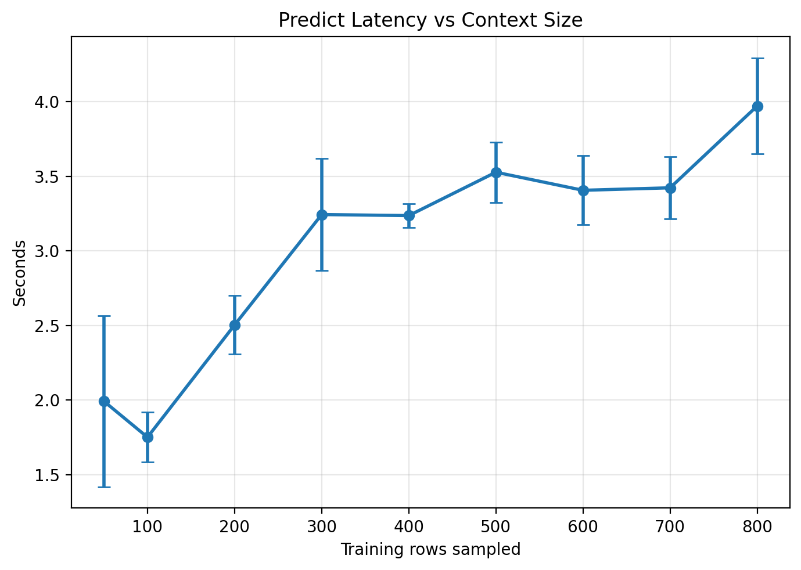
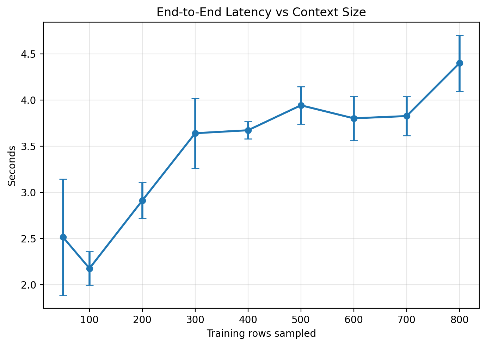

# Task 2a: Context Size vs Accuracy and Latency

This experiment investigates how TabPFN's predictive performance and latency change as the number of labelled training examples provided as context increases. Because TabPFN performs in-context learning, larger context sizes should give the model more information about the relationship between features and labels. The expected trade-off is that prediction becomes more computationally expensive as the context grows.

## Experimental Setup

The experiment uses the `credit-g` dataset as a binary classification task. The dataset is split into a training pool and a fixed test set. From the training pool, context subsets of 50, 100, 200, 300, 400, 500, 600, 700, and 800 rows are sampled. For each context size, TabPFN is evaluated on the same test set.

The recorded metrics are accuracy, ROC AUC, log loss, fit latency, prediction latency, and end-to-end latency.

## Predictive Performance

  
  
  

Increasing the number of training rows generally improves TabPFN's predictive performance. ROC AUC increases from 0.687 to 0.794, while log loss decreases from 0.571 to 0.487 as the context size increases from 50 to 800 rows. Accuracy also improves overall, although there are minor fluctuations across different context sizes.

## Latency Trade-Off

  
  
  

The latency results show a clear computational trade-off. Fit latency remains relatively stable across context sizes, ranging approximately from 0.40 to 0.52 seconds. In contrast, prediction latency increases from 1.99 seconds at 50 training rows to 3.97 seconds at 800 training rows.

This occurs because TabPFN does not perform conventional dataset-specific training during fitting. Instead, it uses the labelled training examples as context during inference. A larger context provides more information for prediction, but it also requires more computation during the transformer forward pass.

## Limitations

This experiment was conducted on one binary classification dataset, so the observed trend may not generalise to regression tasks, multiclass classification tasks, or datasets with different feature distributions. The maximum context size was also limited to 800 rows, so behaviour at larger context sizes was not evaluated.

## Summary

Larger context sizes improve TabPFN's predictive performance on `credit-g`, but prediction latency also increases. This supports the expected trade-off for in-context tabular prediction: more context can improve accuracy, but inference becomes more expensive.
