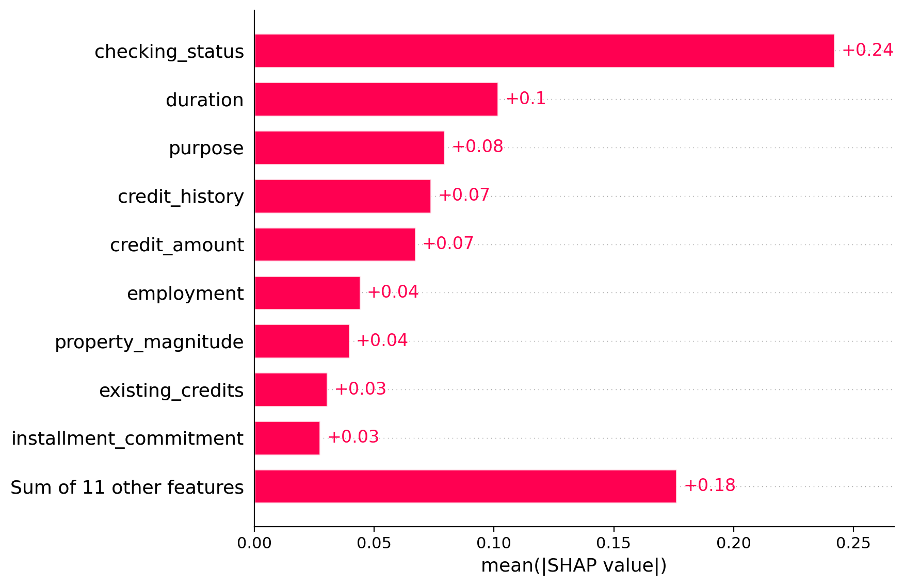
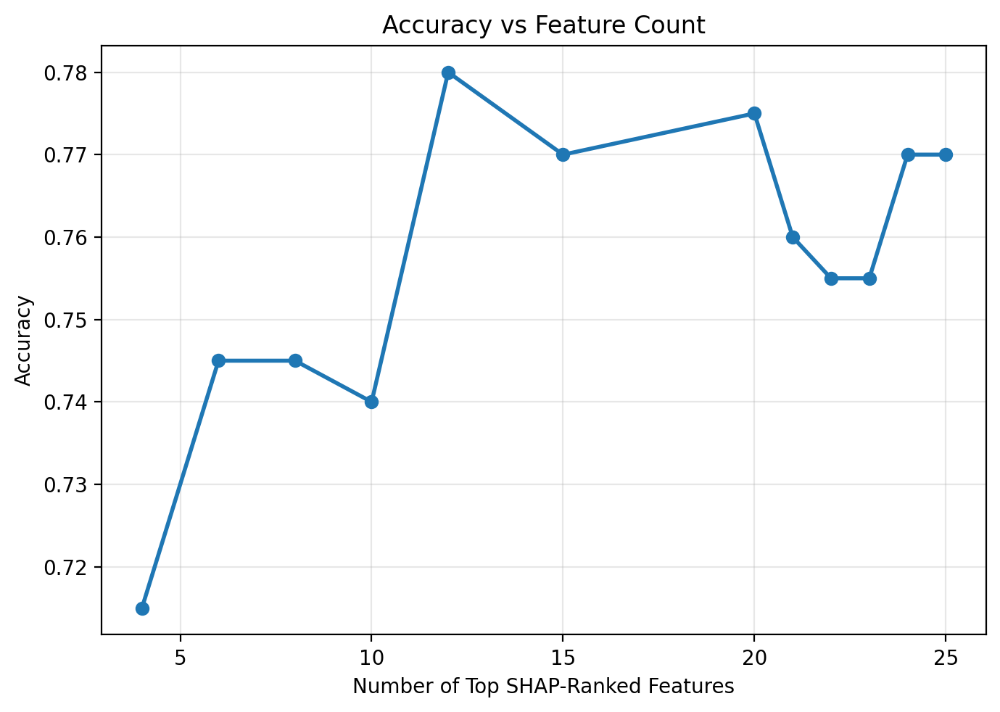
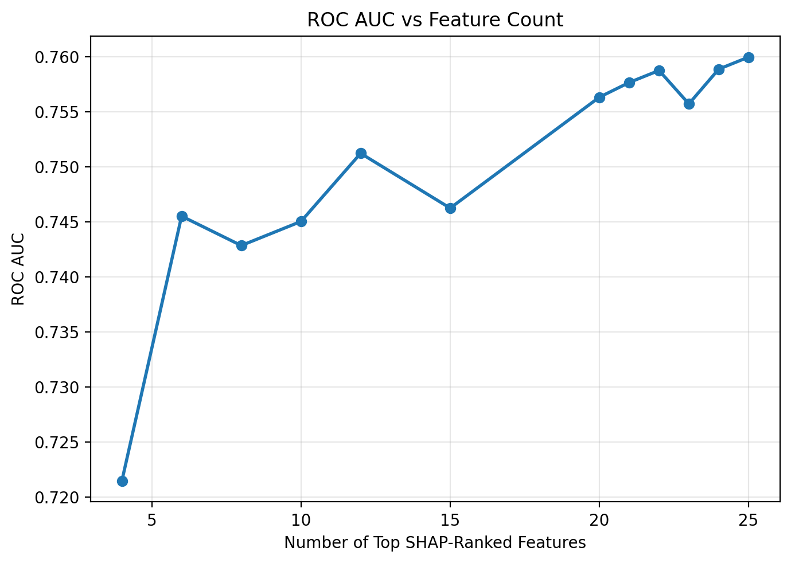
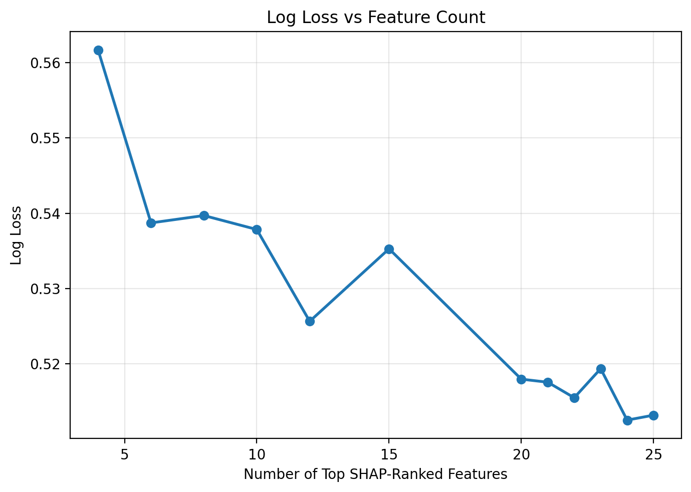
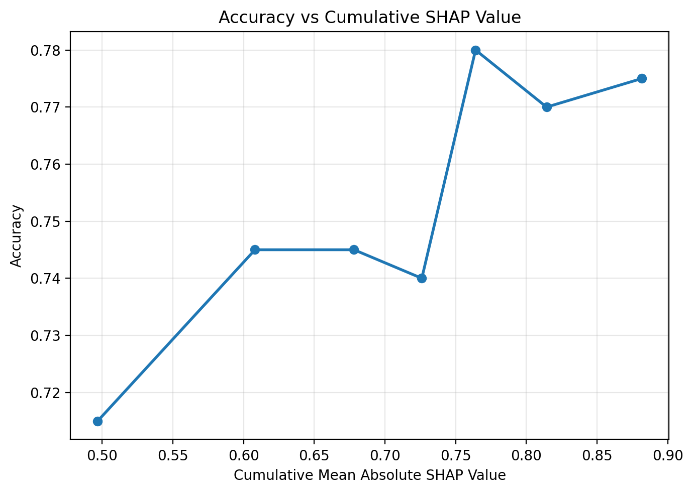
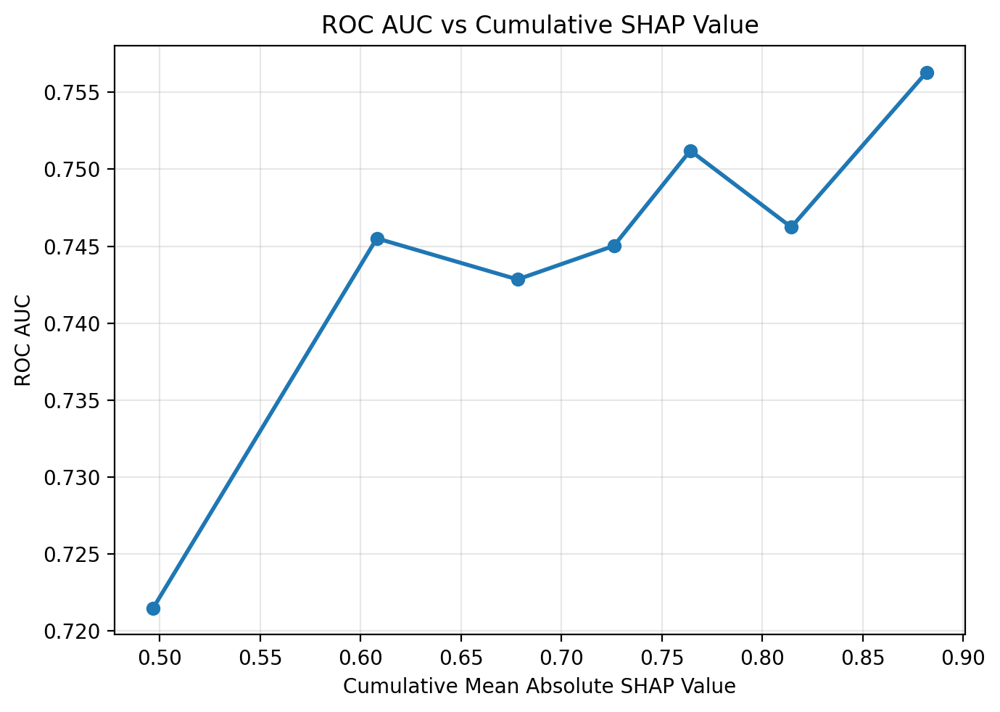
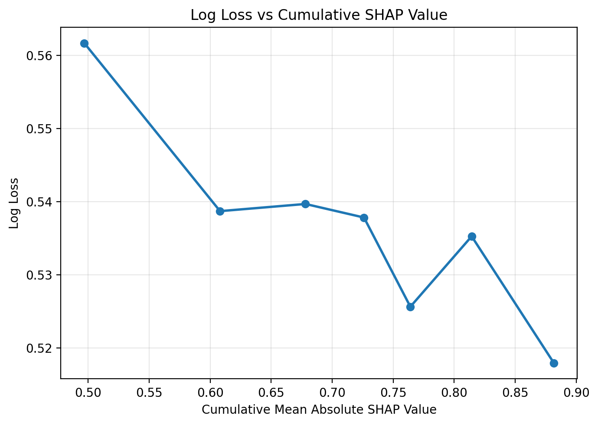
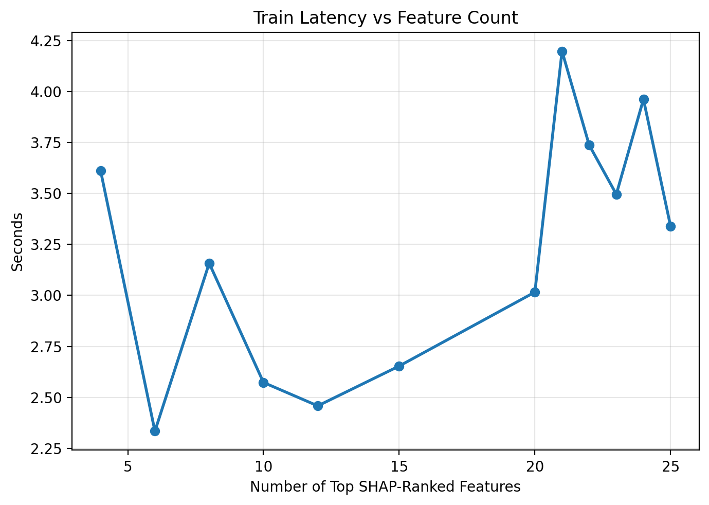
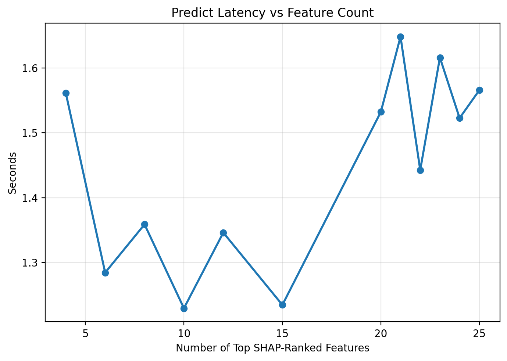
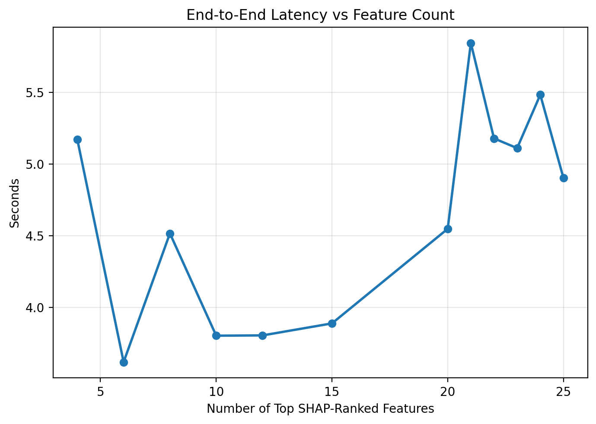

# Task 2c: Feature Dimensionality and Noise Robustness

This experiment investigates how TabPFN's performance is affected by the number and quality of input features. The hypothesis is that adding informative features should improve prediction performance, while adding irrelevant noise features should not provide meaningful improvement. This helps evaluate whether TabPFN benefits from useful predictors while remaining robust to uninformative variables.

## Experimental Setup

The experiment uses the `credit-g` dataset as a binary classification task. Feature importance is estimated using SHAP values, and features are ranked according to their mean absolute SHAP values. TabPFN is then evaluated using the top 4, 6, 8, 10, 12, 15, and 20 most important features.

To evaluate robustness to irrelevant variables, synthetic noise features are gradually added after the original feature set. These noise variables are generated from uniform, normal, binary, sparse binary, and heavy-tailed distributions. The recorded metrics are accuracy, ROC AUC, log loss, fit latency, prediction latency, and end-to-end latency.

## SHAP Feature Importance

  

The SHAP ranking shows that a relatively small set of features accounts for a large share of the predictive signal. The top 4 features already capture approximately 49.7% of the cumulative SHAP importance and achieve reasonable predictive performance.

## Predictive Performance

  
  
  

Prediction performance generally improves as more SHAP-ranked informative features are added. Using the top 4 features achieves an accuracy of 0.715, ROC AUC of 0.721, and log loss of 0.562. Using all 20 original features improves performance to an accuracy of 0.775, ROC AUC of 0.756, and log loss of 0.518. This suggests that additional informative features provide useful predictive signal.

## Performance vs Cumulative SHAP Value

  
  
  

The cumulative SHAP plots show how predictive performance changes as more total feature importance is included. Performance improves quickly when the highest-ranked features are added, then becomes more gradual as lower-importance features are included.

## Latency Trade-Off

  
  
  

Latency generally increases as more features are included, especially for prediction and end-to-end runtime. This reflects the additional computation required when TabPFN conditions on higher-dimensional input.

## Noise Robustness

Adding synthetic noise variables does not produce a meaningful improvement in prediction performance. Performance remains broadly stable when up to five noise features are added, suggesting that TabPFN is relatively robust to irrelevant variables in this experiment. Therefore, the observed performance gain from increasing feature count appears to come mainly from informative features rather than from higher dimensionality alone.

## Limitations

This experiment was conducted on a single binary classification dataset, so the findings may not generalise to regression tasks or datasets with more complex feature interactions. Feature ranking is based on SHAP values from a specific explanatory setup, which may not perfectly represent the features most useful to TabPFN. In addition, the noise variables are synthetically generated and relatively simple, so they may not fully reflect real-world irrelevant, redundant, or confounded features.

## Summary

TabPFN benefits from additional informative features, but much of the useful signal in `credit-g` is concentrated in a small number of high-importance features. Adding synthetic noise features does not meaningfully improve performance, suggesting that TabPFN's gains are driven by informative predictors rather than dimensionality alone.
