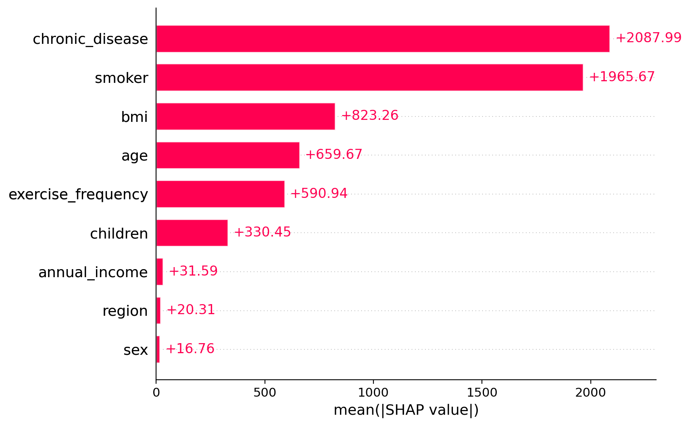
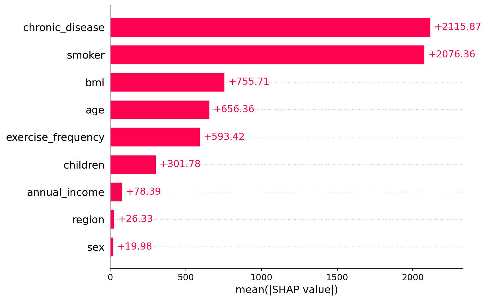
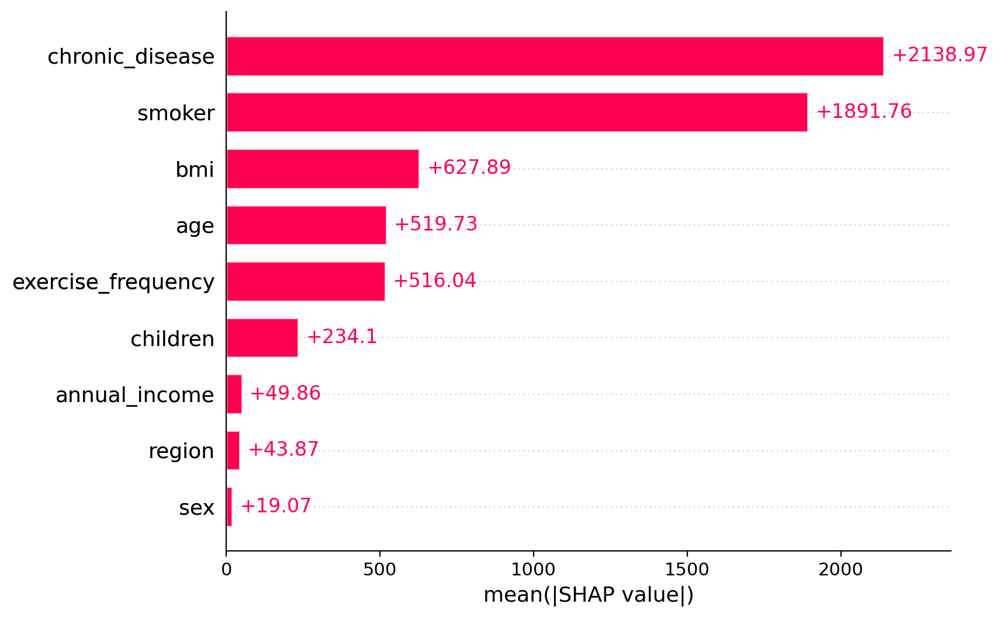
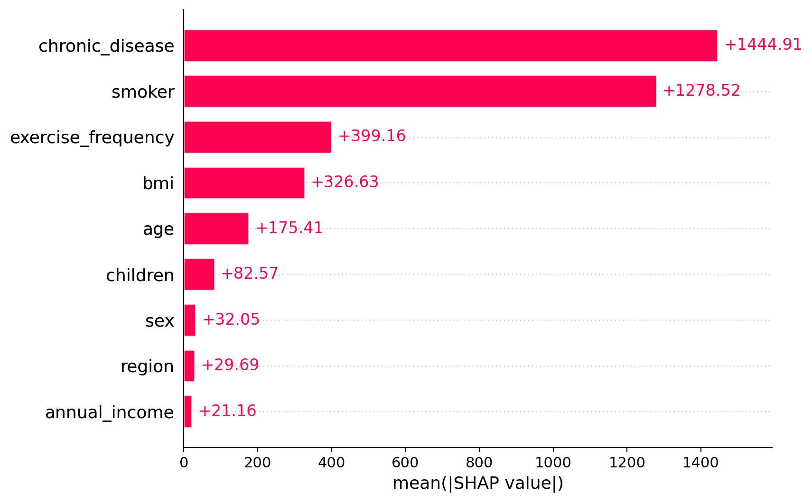
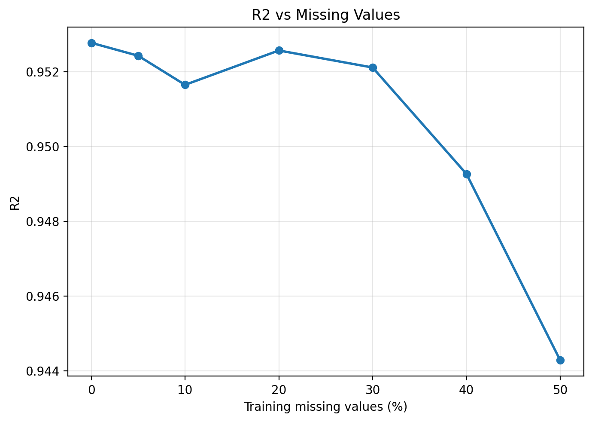
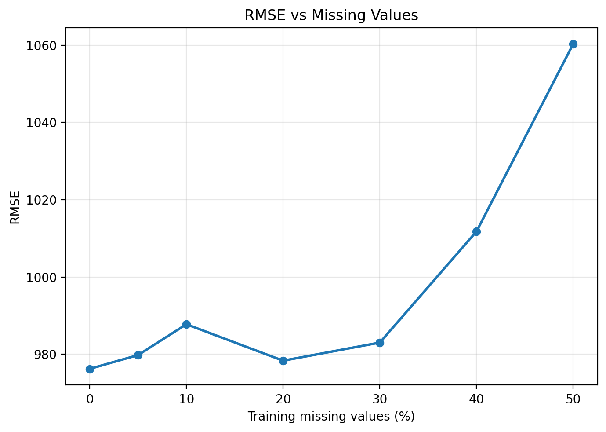
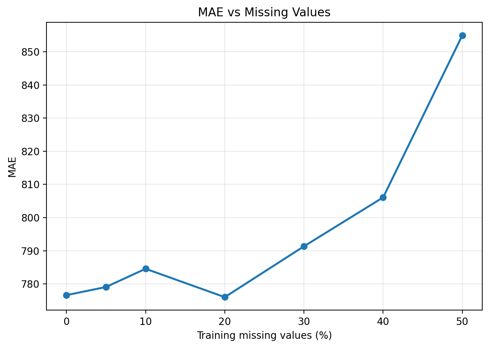
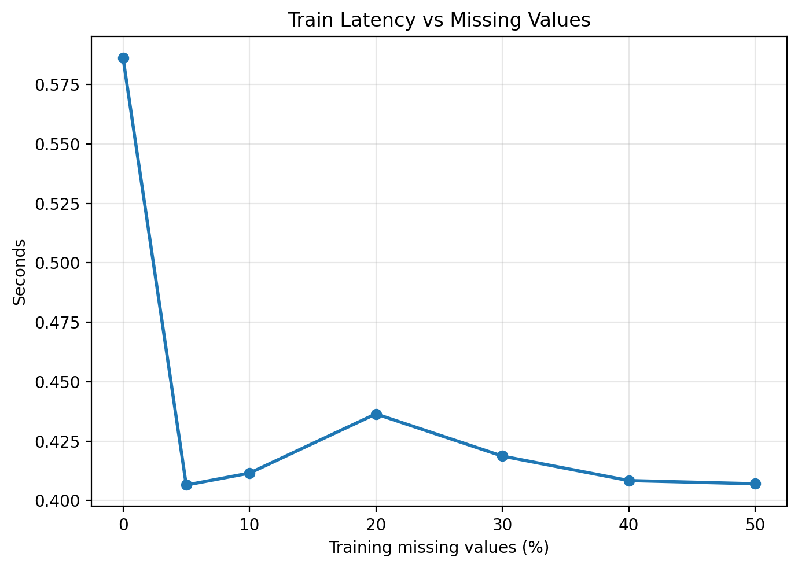
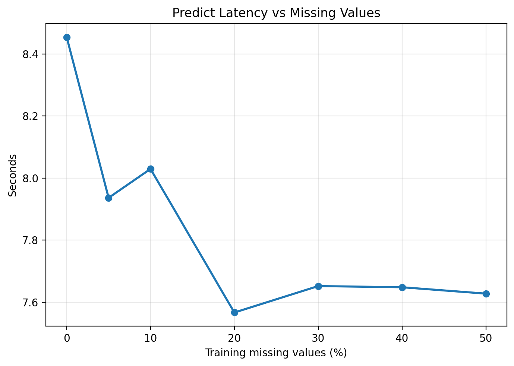
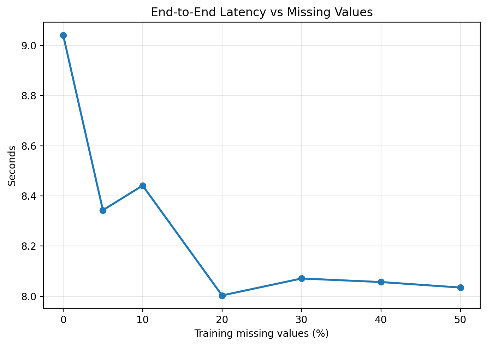

# Task 3: Medical Insurance Cost Prediction Under Missing Data

This experiment evaluates TabPFN on a realistic tabular regression problem: predicting medical insurance cost from customer attributes. The setting is useful because insurance data are structured, heterogeneous, and similar to tabular data used in real-world decision systems.

Two questions are considered. First, can TabPFN identify the dominant cost-driving features using SHAP-based interpretability? Second, how robust are its predictions and feature-importance rankings when increasing proportions of feature values are missing?

## Motivation

Explainability is important in insurance pricing because providers need to justify pricing decisions clearly and transparently. TabPFN is useful in this setting because `tabpfn-extensions` provides SHAP-based interpretability tools that can help explain which variables drive predictions.

Missing data is also a practical challenge. Customers may choose not to disclose certain personal details because of privacy concerns, or some variables may be unavailable during data collection. This experiment therefore introduces increasing missingness levels and evaluates whether TabPFN can still make accurate predictions and recover meaningful feature-importance patterns.

## Experimental Setup

The Medical Insurance Cost Prediction dataset is used as a regression task. Prediction quality is measured using R2, RMSE, and MAE. SHAP values are computed to rank features by mean absolute SHAP value.

The missing-value experiment uses missing rates of 0%, 5%, 10%, 20%, 30%, 40%, and 50%. For each missingness level, missing values are introduced into the training and explanation data, SHAP feature importance is recomputed, and TabPFN is evaluated on the same held-out test set.

## Feature Importance With Complete Data

  

Using the complete dataset, TabPFN identifies six dominant predictive features: `chronic_disease`, `smoker`, `bmi`, `age`, `exercise_frequency`, and `children`. These features have substantially larger SHAP values than the remaining variables, including `annual_income`, `region`, and `sex`. This suggests that TabPFN can distinguish the main drivers of insurance cost from less influential features.

## Feature Importance Under Missing Data

<table>
  <tr>
    <td align="center" width="33%">
      
       
      5% missing values
    </td>
    <td align="center" width="33%">
      
       
      20% missing values
    </td>
    <td align="center" width="33%">
      
       
      50% missing values
    </td>
  </tr>
</table>

The three plots above show SHAP feature importance at 5%, 20%, and 50% missing values. As the proportion of missing data increases, the most important features remain broadly consistent. In particular, `chronic_disease` and `smoker` continue to have the largest SHAP values across most missingness levels. However, the exact ranking becomes less stable at higher missingness levels, and the separation between high-importance and low-importance features becomes less clear. This suggests that missing data reduces the clarity of feature attribution, even when the main predictive variables remain identifiable.

## Predictive Performance

  
  
  

Prediction performance decreases as missingness increases, as expected. With complete data, TabPFN achieves an R2 of 0.953, RMSE of 976.21, and MAE of 776.60. At 50% missingness, performance declines to an R2 of 0.944, RMSE of 1060.36, and MAE of 854.97.

Although this is a measurable drop, the decline is relatively modest given that half of the training feature values are missing. This suggests that TabPFN remains robust under incomplete-data conditions in this experiment.

## Latency

  
  
  

Latency remains broadly stable across missingness levels. Prediction latency dominates total runtime, which is consistent with TabPFN's inference-time conditioning on the provided context.

## Limitations

This experiment uses randomly introduced missing values, which may not fully represent real-world missingness patterns. In practice, missing data may be systematic, where certain groups of customers or specific variables are more likely to be missing. The experiment also evaluates only one regression dataset, so the findings may not generalise to other insurance datasets or domains.

SHAP explanations can also become less stable under high missingness. Feature-importance results should therefore be interpreted cautiously when data quality is poor.

## Summary

TabPFN identifies a stable set of dominant insurance cost drivers, especially `chronic_disease` and `smoker`. Prediction performance decreases as missingness increases, but the decline is modest even at 50% missing values. Overall, the experiment suggests that TabPFN can remain useful for both prediction and interpretability under incomplete-data conditions, while feature attribution becomes less precise as missingness grows.
